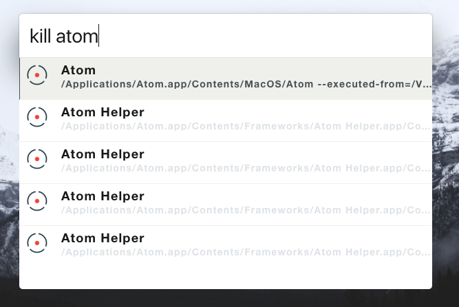

# zazu-fkill

[](https://travis-ci.org/chrishelgert/zazu-fkill)
[](https://ci.appveyor.com/project/chrishelgert/zazu-fkill)
[](https://codecov.io/gh/chrishelgert/zazu-fkill)

> A [Zazu](https://github.com/tinytacoteam/zazu) Plugin to kill processes with [fkill](https://github.com/sindresorhus/fkill)

## Usage

Simple type in `kill` with the process-name, choose the wished one and let it die.



## Install

Add `chrishelgert/zazu-fkill` to your plugins block inside your `.zazurc.json` file.

```json
{
  "plugins": ["chrishelgert/zazu-fkill"]
}
```

## Options

Add `-f` or `--force` and the end of your query, to force kill the process.

## Contributing

1. Fork it
2. Create your feature branch
3. Commit your changes
4. Push to the branch
5. Create new Pull Request

## LICENSE

Copyright (c) 2017 Chris Helgert. See [License](./LICENSE) for details.
